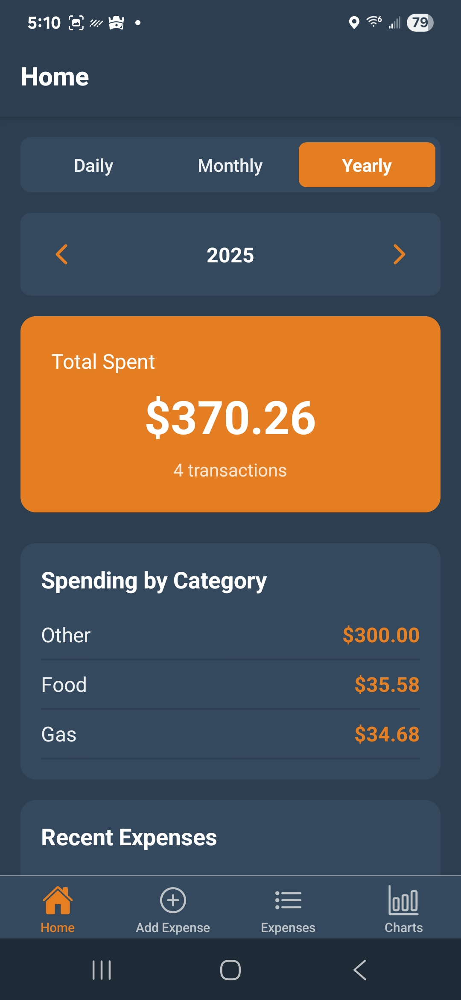
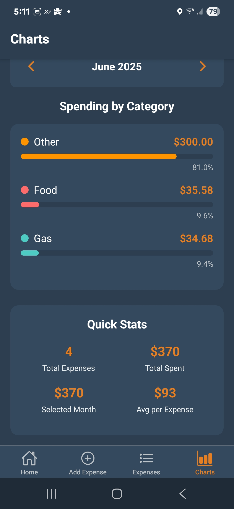
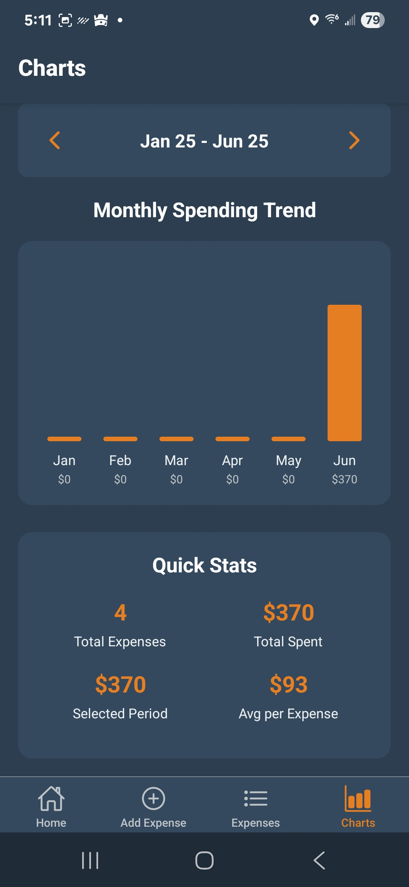

# Budget Tracker

An expense tracking application built with React Native and Expo. Track your spending, set budgets, and visualize your financial data with interactive charts.

## Download

### Android
[Download Latest Release](https://github.com/yourusername/budget-tracker-app/releases/latest)

### iOS
Coming soon

## Features

- **Expense Tracking**: Log daily expenses with categories and descriptions
- **Budget Management**: Set monthly budgets and track spending against limits
- **Visual Analytics**: Interactive charts showing spending patterns and trends
- **Historical Data**: Navigate through past months to review spending history
- **Budget Warnings**: Get notified when approaching or exceeding budget limits
- **Offline Storage**: All data stored locally on your device

## Installation Instructions

### Android
1. Download the APK file from the latest release
2. On your Android device, go to Settings > Security
3. Enable "Install from Unknown Sources" or "Allow from this source"
4. Open the downloaded APK file
5. Follow the installation prompts
6. The app will appear on your home screen

## Screenshots

## System Requirements

- **Android**: Version 6.0 (API level 23) or higher
- **Storage**: 50MB available space
- **RAM**: 2GB minimum recommended

## Privacy

- All data is stored locally on your device
- No personal information is collected or transmitted
- No internet connection required after installation

## Support

If you encounter any issues or have questions, please create an issue in this repository.

## Version History

### v1.0.0
- Initial release
- Core expense tracking functionality
- Budget management
- Interactive charts

---

Copyright 2025. All rights reserved.
This software is provided for personal use only.

